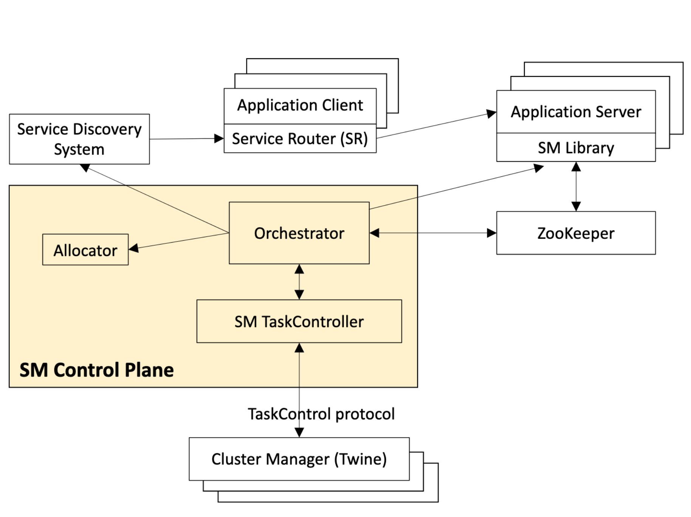
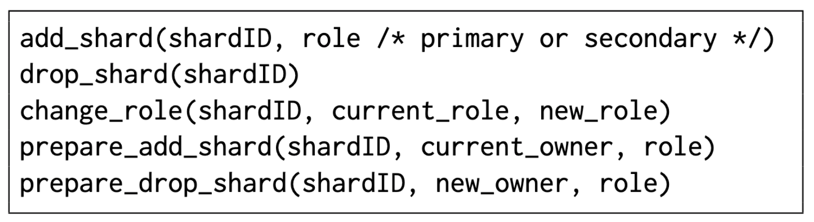

# Shard Manager: A Generic Shard Management Framework for Geo-distributed Applications

## Overview

This paper introduces Shard Manager(SM), a system used widely in Facebook to solve the problem that most distributed applications faced. Including 

1. High availability support, especially for the applications that has **primary-secondary** shard roles.
2. Replication, how should we replicate the shards of different applications.
3. Stability support, i.e balance the load of different shards(pods/replicas/etc).
4. Geo-distributed support, applications in FB are scaling across contintents. How to keep HA, Stability at such scale is also challenging.

The paper first analyze the open-source and proprietary sharding frameworks such as Twitter's Gizzard, Uber's Ringpop, Google's Slicer[1] and Microsoft's Azure Service Fabric. It identifies the difference between them, and address the problem about the "adoption barrier" of sharding frameworks, i.e there isn't a "one size fits all" sharding framework due to the lack of support of high-availability and geo-distributed applications. (But I doubt the reasons they listed are true or not)

Then the author investigated a series of distributed/sharded applications in Facebook and categorized them into different groups. The whole **Section 2** is talking about the different requirements of different types of sharded applications. And they identifies the following major factor of a sharded application.

* Sharding Schemes
  - Consistent Hashing
  - Static Hashing
  - Sharding by Range
* Regional vs Geo-Distributed Deployment
* Placement and Load Balancing Strategy (PLB)
  - Hand written load-balancer (FB previously used this)
  - Generic solver to solve an optimization problem
* Drain Policy
  - Drain the shards out when it is primary
  - Tolerate the downtime and allow quick migration (no drain) 
* Shard Replication Strategy
  - Primary Only: For each shard/partition, there is only one replica
  - Secondary Only: For each shard/partition, there is multiple replicas and they play the same role
  - Primary-Secondary: Each shard/partition has multiple replicas, and one of them is SM elected primary replica, the others are secondary replicas. Mostly, the primary replica handle writes.

Next, the author presents the architecture of SM.

## System Architecture

### Sharding Approach
Different sharding approach has different pros and cons, here is a comparison chart of what kind of approach ASF, SM and Slicer use.

|        |UUID-key|App-Key|
|--------|-------|--------|
|App-sharding|X|ASF, SM|
|Framework-sharding|Slicer|X|

* UUID Approach can make the data more evenly distributed, but the **tradeoff** is it destroys the key locality, cannot support efficient prefix-scan or range scan. In practice Laser in FB has 9% of the billion QPS is about prefix scans.

* SM chooses App-Sharding and App-Key in order to provide more flexibility to applications, but it makes the Placement and Load Balancer (PLB) more complex.

### Architecture
Based on the approach above, the author introduces the architecture of SM:

* Application Server: various applications in FB written by developers. The application is running in a container (pod?). The server hosts one or more shards assigned by the **Orchestrator**.
* SM Library: a library that is linked to the **Application Server** and response to the commands from the orchestrator.
* Service Router: another library that is linked to application clients (such as application SDK, CLI programs etc), it learns from the **Service Discovery System** such as Dubbo / HSF / Consul and know which server is serving which shard/partition and request them accordingly.
* Orchestrator: the brain of the SM, it provides the following functionalities:
    - Monitor the health of each shard
    - Monitor the resource consumption of each shard
    - Distribute the "shard map" to **Service Discovery System**
    - Invoke allocator to generate new replicas when some replicas in that shard are dead (**?**)
* Allocator: The load balancer of SM, it is invoked by the **Orchestrator** when the **Application Server** fails or the load changes.
* Cluster Manager (Twine): Informs SM TaskController about hardware maintenance events and other kinds of scheduled events. (Question: How does the SM TaskController control a machine to get down to maintenance via Orchestrator and Allocator?)
* ZooKeeper: Store the persistent state of **Orchestrator**, and **Application Server** read from **ZooKeeper** to know its shard assignment. (Question: will this work be too heavy for the ZooKeeper?). The ZK is also used to detect failures of the application servers.

### SM Library API 

The application needs to implement the following APIs in order to get controlled by the SM orchestrator. Then orchestrator will invoke these functions when it need to migrate/control the shards across different servers.

## Load Balancing Strategy

As we discussed before, the flexibility SM provides to the application has a trade-off, it makes PLB much harder than Slicer's approach. To address this problem, the authors identify the following **hard constriants** and **soft goals** to achieve after the PLB process:

* Hard Constraints:
  - System Stability: Limit the concurrency of shard migration on each application server and system-wide.
  - Server Capacity: For each of the LB metrics (such as CPU, disk usage), the agg consumption should not exceed server capacity. (Question: Does the capacity means maximum capacity or it is a safe watermark? Answer: Should be the max capacity, since there is another soft goal related to safe watermark below: Utilization Threshold)
* Soft Goals (From high to low priority):
  - Region Preference
  - Spread replicas across different fault domains
  - Allow graceful migration / shutdown during maintenance
  - Try to keep the application server utilization doesn't exceed a threshold
  - Balance the load across different regions
  - Balance load across servers within a region (Question: why this item has lower priority than global load balancing?)
  - Parallel shard failover (Question: I don't know what this strategy is doing)

Shard Allocations has two modes, by seperating modes between different use-cases, the SM can achieve nearly real time allocation(schedule) at scale.

* Emergency Mode: Triggered instantly while satisfiying the hard constraints, but can deteriorate soft goals **temporarily**.
* Periodic Mode: Runs regularly, keeps hard constraints, takes a longer time to balance, and **must not** deteriorate soft goals.

Given the abovementioned constraints and goals, SM adopted ReBalancer. ReBalancer provides the API for user to specifiy "constraints" and "goals" which just matches to the SM "constraints" and "goals". (Comments: I think that's why SM want to model their objectives as "constraints" and "goals" because ReBalancer has this kind of interface.)

ReBalancer has different solvers: **MIP (Mixed Integer Programming)** and  **Local Search[2]**. SM uses **Local Search** to scale the constraint solver.
SM also uses the traditional techniques such as batch requests, prioritize requests to achieve near real-time performance. ReBalancer separate the problem two to parts: System developer try to model the placement problems, and the optimization experts improves the optimizer performance & result based on the highly abstracted model system developers provided.

* [ ] TBD(void001): The detail about the solver is not elaborated in this paper.

## My Comments

1. I feels the the argument on "there isn't a one-size-fit-all sharding manager" is just an excuse about why they build another sharding manager..
2. What astonished me is that the FB ZippyDB only need 3 replicas to provide high availabilty, how is this achieved?
3. The high availability part in the paper doesn't suprise me too much, basically it is doing something like transfer the primary role out, always keep majority (in SM's case, it is 2 replicas per shard) online.
4. The interesting part is about how they handle the load balance elegantly by modeling the problem as an optimization problem and apply the generic solver.
5. How can this case happen? 
> For example, an SM application may choose to use three uneven
shards denoted by shardID:[key_range] as follows: S0:[1,9],
S1:[10,99], S2:[100,100000]

## Extended Reading
* Here is a list of Facebook's systems
  - ZippyDB: https://engineering.fb.com/2021/08/06/core-data/zippydb/
  - Laser: https://web.eecs.umich.edu/~mosharaf/Readings/Facebook-Streaming.pdf
  - ReBalancer: _I didn't find any resource yet_
  - Twine: https://www.usenix.org/system/files/osdi20-tang.pdf

---
# References
\[1\]: https://www.usenix.org/system/files/conference/osdi16/osdi16-adya.pdf

\[2\]: https://www.researchgate.net/publication/220780245_Local_Search_in_Combinatorial_Optimization
